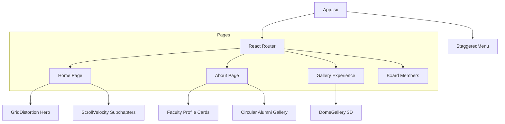

<div align="center">
  # Code Blue: IEEE Student Branch NU
  ### Advancing Technology for Humanity. Empowering the Future.
  
  [](https://reactjs.org/)
  [](https://vitejs.dev/)
  [](https://developer.mozilla.org/en-US/docs/Web/CSS)
  [](https://vercel.com/)

  **A premium, high-performance web experience for the IEEE Student Branch at Nirma University.**
</div>

---

## 💎 Project DNA

Code Blue is designed with a **Sophisticated Glassmorphic** aesthetic and **Bold Brutalist** typography. It leverages high-end WebGL graphics and fluid animations to create an immersive digital identity for our branch.

### 🚀 Interactive Components

| Feature | Technology | Description |
| :--- | :--- | :--- |
| **GridDistortion Hero** | WebGL / OGL | A kinetic, mouse-responsive image distortion effect on the landing page. |
| **Immersive Dome Gallery** | GSAP / ThreeJS | A cinematic 3D carousel experience with spatial audio for event highlights. |
| **Staggered Navigation** | GSAP Timelines | A fluid, multi-layered navigation system with staggered element transitions. |
| **Circular Alumni Gallery** | CSS / Layout | A unique, curved thumbnail gallery showcasing our distinguished alumni. |
| **Profile Cards** | Tilt.js / CSS | 3D interactive cards with parallax effects for faculty and board members. |
| **Scroll Velocity** | GSAP ScrollTrigger | Dynamic, speed-linked typography highlighting our various subchapters. |

---

## 🏗️ Technical Architecture

The site is built as a highly interactive SPA, prioritizing smooth transitions and viewport-based responsive scaling.



---

## 🛠️ Developer Setup

Standardized environment for rapid local development.

### Prerequisites
- **Node.js**: v18.0.0+
- **Terminal Preference**: Use `;` for multi-command sequences on Windows.

### Installation
```bash
# 1. Clone the repository
git clone https://github.com/IEEE-Student-Branch-NU/Code-Blue.git ; cd Code-Blue

# 2. Setup Environment
npm install

# 3. Launch Development
npm run dev
```

---

## 📂 Project Blueprint

```bash
src/
├── components/           # Core interactive modules
│   ├── GridDistortion.jsx # WebGL Hero animation
│   ├── DomeGallery.jsx    # Cinematic 3D experience
│   ├── StaggeredMenu.jsx  # Global navigation system
│   └── Footer.jsx         # Proportional scaling footer
├── pages/                # Route transitions
│   ├── Home.jsx           # Landing / Mission / Vision
│   ├── Gallery.jsx        # Audio-visual experience portal
│   └── ...
└── lib/                  # Performance utils & hooks
```

---

## 🤝 Contact & Community

Join our mission to bridge the gap between academia and industry.

- 📧 **Institutional Mail**: [ieee@nirmauni.ac.in](mailto:ieee@nirmauni.ac.in)
- 🔗 **LinkedIn**: [IEEE Student Branch Nirma University](https://www.linkedin.com/company/ieee-student-branch-nirma-university)
- 🏢 **Location**: Nirma University, Ahmedabad, Gujarat, India.

---

<div align="center">
  Made with ⚡ and ❤️ by <b>IEEE Student Branch, Nirma University</b>
</div>
