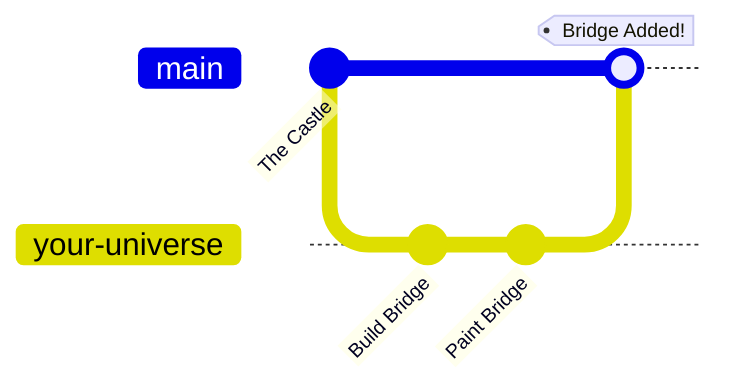

<div align="center">


# � Level 0: The Developer's Journey
### *From "What is GitHub?" to "I just merged my first PR!"*


*“Everyone starts somewhere. Today, you start here.”*

[🤔 What is all this?](#-chapter-1-the-concepts) • [�️ Setup Your Gear](#-chapter-2-loading-the-tools) • [⚔️ Your First Mission](#-chapter-3-your-first-quest)

</div>

---

## 🧠 Chapter 1: The Concepts (Explained simply)

Imagine we are building a massive LEGO castle together.

### 1. What is Git? 💾
**Git** is a **Time Machine**.
*   Every time you place a LEGO brick, you take a photo.
*   If you make a mistake (like smashing a tower), you can "load" the photo from 5 minutes ago.
*   *In Tech:* It saves versions of your code history.

### 2. What is GitHub? ☁️
**GitHub** is the **Cloud Storage** for those photos.
*   It's where we keep the "Master Copy" of our LEGO castle so everyone can access it.
*   *In Tech:* It's a website that hosts your Git repositories.

### 3. What is a Repository (Repo)? 📦
The **Repo** is the **LEGO Box**.
*   It contains all the bricks (files) and the instruction manual (README).

### 4. What is a Branch? 🌿
This is the magic. Imagine creating a **Parallel Universe**.
*   **The `main` Universe**: The finished castle that visitors look at.
*   **Your `feat/bridge` Universe**: You take a copy of the castle to a separate room to build a drawbridge.
*   *Why?* If your drawbridge collapses, the `main` castle is safe! You only bring it back when it's perfect.



---

## �️ Chapter 2: Loading the Tools

Before we play, we need to install the game.

### Step 1: Tell Git who you are 🆔
Open your terminal (PowerShell or Command Prompt) and type this:
```bash
git config --global user.name "Your Name"
git config --global user.email "your.email@example.com"
```

### Step 2: Get the Castle (Clone) 🏰
Bring the code from the cloud to your computer.
```bash
# This creates a folder called 'Code-Blue' on your PC
git clone https://github.com/IEEE-Student-Branch-NU/Code-Blue.git
cd Code-Blue
```

---

## ⚔️ Chapter 3: Your First Quest

**Objective**: Create a file with your name in the `dev` branch.

### 🟢 Mission Start: Enter the Dev World
We never touch the `main` code directly. We work in `dev`.
```bash
git checkout dev
git pull origin dev  # Get the latest updates
```

### 🟡 Action: Create Your Timeline (Branch)
Let's make your personal workspace.
```bash
# 'feat' means Feature. 'add-vraj' is the name.
git checkout -b feat/add-your-name
```
*You are now in a safe parallel universe!*

### 🔵 Action: Do the Work
1.  Create a file named `your-name.md` (e.g., `batman.md`).
2.  Write "I am ready to code!" inside it.
3.  Save the file.

### 🟣 Action: Save Progress (Commit)
Tell Git to take a snapshot.
```bash
git add .
git commit -m "feat: adding my first file!"
```

### 🔴 Boss Fight: Upload (Push)
Send your universe to GitHub.
```bash
git push -u origin feat/add-your-name
```

---

## 🏆 Chapter 4: The Merge (Pull Request)

You built the feature. Now, let's add it to the real castle.

1.  Go to **[GitHub.com/IEEE-Student-Branch-NU/Code-Blue](https://github.com/IEEE-Student-Branch-NU/Code-Blue)**.
2.  You will see a yellow box saying **"Compare & pull request"**. Click it!
3.  **IMPORTANT**: Make sure the arrow points to `dev` (not `main`).
    *   `base: dev` ⬅️ `compare: feat/add-your-name`
4.  Click **Create Pull Request**.

🎉 **VICTORY!** You have successfully contributed.

---

## 🆘 Cheat Codes (Common Commands)

| Command | Why use it? |
| :--- | :--- |
| `git status` | "Where am I? What did I change?" (Check this often!) |
| `git checkout dev` | "Take me back to the main lobby." |
| `git pull` | "Update my game files." |
| `git branch -d name` | "Delete this universe, I don't need it." |

---

<div align="center">

### *Ready for the next level?*
**Ask @GalacticVraj for your next assignment.**

</div>
